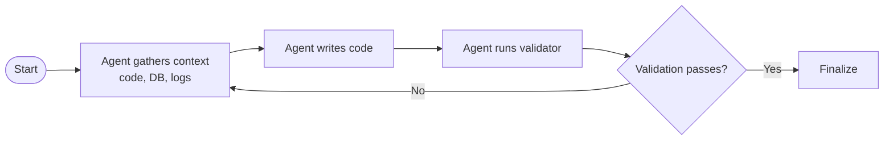

On December 16–17, 2025, I attended QCon AI New York, one of the most respected software engineering conferences in the world — this time 100% focused on AI.

QCon has always been about one thing: real-world engineering. Not demos. Not hype. Not promises.

This edition made something very clear: AI has matured. We’ve officially entered the era of **AI engineering** — where processes, validation, observability, cost, failures, and real impact matter more than clever prompts.

Jaya was present at QCon AI New York with a clear goal: learn what’s working in the real world, capture the patterns that matter, and bring back practical tools, practices, and engineering approaches we can apply with both our clients and our teams.

Among many excellent talks, three stood out to me. They weren’t just technically strong — together, they form a cohesive story about using AI as an amplifier through process, understanding limitations, and shipping systems that improve with real usage. That’s what I’ll cover in this post.

---

## 1. Moving Mountains: Migrating Legacy Code in Weeks Instead of Years

**David Stein — Principal AI Engineer @ ServiceTitan**

He opened with a problem that will sound painfully familiar if you’ve ever touched a legacy codebase: migrations that drag on for years, hide dependencies until late, and make every rollout feel risky.

What he set out to solve was straightforward to state and brutally hard to execute: **turn “multi-year migrations” into something you can complete in weeks—without losing correctness or control.**

When he talked about “migration”, he wasn’t talking about DB's dumps/restore or simple one-off scripts. Instead, he was talking about **complex code migration**: language changes, deep refactors, and large codebases with lots of moving parts.

The concrete use case shared was migrating **hundreds of KPIs** from legacy reporting datasets into a new system based on **DBT MetricFlow**.

He also called out that the “vibe” approach—just asking an LLM to “do the migration”—doesn’t work well in practice, because:

- the task is simply **too large**
- there isn’t enough **relevant context** available to the model at once
- it’s **extremely easy** for the model to hallucinate

That’s where the first big insight comes in: **break the work into smaller pieces that can be verified or validated**, and that an agent can realistically complete end-to-end.

### The framework: Decompose → Standardize → Automate

The solution wasn’t magic — it was engineering discipline applied to AI:

- **Decompose**: break migrations into small, executable, verifiable steps
- **Standardize**: define strict validation before automation
- **Automate**: use LLMs as executors inside a safe, constrained pipeline

#### 1) Decompose

The principle is to define the **smallest possible unit of work** that can be validated and completed independently.

Instead of a prompt like:

> Migrate all N KPIs...

…you aim for something like:

> Migrate a _single_ KPI — “TotalRevenue” from the “Jobs” dataset to DBT MetricFlow

#### 2) Standardize

The central component here is the **validator**. Agents keep working until the validator says the output matches the expected result. The more refined (and deterministic) your validator is, the better the overall outcomes tend to be.

In ServiceTitan’s case, they built a Python script that ran the agent-generated code against real schemas and test data, comparing outputs.

That way, each migration step is automatically validated before moving on.

#### 3) Automate

To automate reliably, you need to provide the tools and scaffolding agents require to execute the work safely and consistently—things like:

- configuration/context `.md` files for each slice of the migration
- a task list that makes the decomposition explicit
- clear instructions for how validators must be run and interpreted
- controlled access to required tooling (like CLIs), with appropriate security constraints

From there, the pipeline becomes a tight loop:

The takeaway is clear: **validation is the key**. The more refined and deterministic this step is, the higher is the chance of success.

To me, this is a perfect example of AI as an amplifier: the LLM isn’t the strategy, it’s the execution engine. The amplification comes from the engineering around it—tight scoping, deterministic validation, and a repeatable loop that turns “huge, scary migrations” into a sequence of small, provable wins.

---

## 2. Rules for Understanding Language Models

**Naomi Saphra — Kempner Research Fellow @ Harvard | Incoming Faculty @ Boston University**

Naomi brought a perspective I think every engineer using LLMs needs. Humans understand each other pretty well, but when confronted with machines that talk, we can’t assume they will act like humans—or for the same reasons humans do.

Her goal in “Rules for Understanding Language Models” was to make LMs less mysterious by sharing a set of principles that explain their behavior and, crucially, their failure modes. If you don’t have this mental model, it’s easy to fall into common pitfalls and end up creating more work than you save by using LLMs in the wrong tasks or settings.

### Five rules that explain how language models behave

- **An LM memorizes when it can.** Often, models take the easiest route: memorization from training data rather than learning underlying concepts. That’s why you can see highly fluent output that still lacks true understanding.
- **An LM acts like a population, not a person.** A single answer is only one sample. Treat the model like a distribution, and you can often do better by sampling multiple outputs and aggregating them—more “wisdom of the crowd” than “one assistant with one opinion”.
- **An LM aims to please.** Models are optimized to be helpful and agreeable, which can lead to overly confident answers and sycophantic behavior.
- **An LM leans on subtle associations.** Many outputs come from patterns and correlations learned from text, not from a deeper semantic or causal understanding of the world.
- **An LM learns only what’s written down.** If something isn’t well represented in the written record—whether a niche domain or an under-resourced language—the model’s understanding will be limited, and it may propagate misconceptions found in its sources.

She backed these rules with observations that map closely to what we see in real usage:

- Because memorization is “cheap”, models may regenerate text nearly verbatim when it’s seen frequently in training—she mentioned familiar sources like Bible quotes as a clear example.
- The “population” framing is why strategies like sampling multiple answers (tuning temperature to control variability) and then aggregating can improve reliability in practice.
- Limited written data for less represented languages makes performance uneven; the model can’t learn what it hasn’t seen.

### The key insight for me

To use AI as an amplifier, I need to design with these rules in mind. They don’t just explain why LLMs fail—they explain how to harness them effectively (and safely) by choosing the right task, the right settings, and the right checks.

---

## 3. What I Learned Building Multi-Agent Systems From Scratch

**Paulo Arruda — Staff Engineer @ Shopify**

Paulo Arruda leads AI orchestration at Shopify and is the creator of Claude Swarm and SwarmSDK—a Ruby-based multi-agent framework that turned a lot of “hours of work” into “minutes”. But what made this talk memorable wasn’t a perfect architecture diagram. It was the origin story.

### It started with a hack day and a copy-paste problem

The system emerged from a very specific frustration: during a hack day, Paulo was working with **two Claude Code windows**, manually copying code back and forth. Slow, repetitive, error-prone—and it was exactly the kind of workflow that makes you think: “there has to be a better way.”

What started as a small experiment became an orchestration tool that took a real internal process from:

> 22 hours → 7 minutes

…and then saw meaningful adoption across Shopify.

To make this more concrete, Paulo also showed the OSS project behind this approach: **SwarmSDK** (https://github.com/parruda/swarm).

At a high level, **SwarmSDK is a Ruby framework for orchestrating multiple AI agents as a collaborative team**, with a few design choices that map directly to the lessons from the talk:

- **Single-process orchestration**: rather than coordinating many separate agent processes, SwarmSDK runs agents in a single Ruby process (built on top of RubyLLM). That reduces the overhead and some of the complexity you get when everything is “microservices for agents”.
- **Multi-provider support**: because it leverages RubyLLM, it can run against multiple LLM providers (Claude, OpenAI, Gemini, etc.), which makes the orchestration layer more reusable.
- **Explicit roles, tools, and delegation**: agents are configured with specialized roles, allowed tools, and a delegation graph—so you can build “teams” where a lead agent routes work to specialists instead of relying on one giant prompt.
- **Production-minded controls**: it includes fine-grained permissions, structured logging, and cost tracking—features that matter once the system is used daily.
- **Workflows + hooks**: beyond “chat”, it supports node-based workflows (multi-stage pipelines with dependencies) and a hooks system to run actions at key moments (for example, running commands and appending outputs to context).
- **Persistent memory (SwarmMemory)**: an optional memory layer provides semantic search with FAISS indexing and local embeddings, so agents can retain and retrieve knowledge over time rather than re-discovering everything every run.
- **CLI experience (SwarmCLI)**: the repo includes a CLI with both interactive (REPL) and non-interactive modes, which helps teams actually adopt it in day-to-day work.

In other words: the “multi-agent” part isn’t just multiple prompts—it’s an orchestration toolkit that makes specialization, delegation, repeatable workflows, and long-term context practical.

### The lessons that only real adoption teaches

Paulo’s core message was that multi-agent systems become useful when they evolve from real pain into real usage—not when they start as an abstract design exercise.

Here are the lessons he emphasized (and the ones that stuck with me):

- **The best automation starts with your own pain.** If it hurts for you, it probably hurts for others—especially at scale.
- **Specialization beats complexity.** A handful of focused agents tends to outperform a single “mega prompt” that tries to do everything.
- **Users reveal what you actually built.** Some of the most interesting adoption came from non-technical teams, who found workflows and use cases the builders didn’t anticipate.
- **Listen more than you design.** Real usage teaches more than any framework doc. Don’t get attached to your first architecture.
- **Evolution beats perfection.** Ship → learn → iterate. Multi-agent workflows get better through feedback loops, not upfront certainty.
- **Patterns emerge organically.** One surprising pattern that appeared was **tree-based collaboration**—a structure that emerged naturally from how people break down work and delegate tasks.

He also highlighted the “messy middle” that shows up once it’s no longer a demo:

- managing context effectively (what each agent should know, and what it should never see)
- dealing with failure modes like retries/loops (especially when the system resembles a microservice network)
- observability: understanding what happened, why it happened, and how to debug it

### The key insight for me

For me, this was a strong reminder of the theme of the whole conference: **AI is an amplifier when you build a system around it.**

Multi-agent approaches aren’t magic but when the work is decomposable, the agents are specialized, and the product evolves through real usage, they can turn painful workflows into leverage.

---

## Final thoughts: turning these talks into real work

QCon AI 2025 made one thing clear: AI has entered its engineering era. The question now isn’t “can an LLM do it?”, but “how do we design a system where AI reliably amplifies engineering outcomes?”

At Jaya, for some clients we’re actively working on **complex legacy migrations**—for example, consolidating systems and moving from **microservices to a monolith**. That kind of work is exactly where the ideas from these three talks become immediately applicable.

Here’s a practical playbook that combines the highlights:

- **From David Stein: process and validation first.** Break the migration into the smallest possible units that can be validated independently (e.g., “migrate one endpoint” instead of “migrate the whole service”). Put a deterministic validator in the loop (tests, contract checks, schema comparisons, golden outputs).
- **From Paulo Arruda: specialized multi-agent execution.** Once the work is decomposed, plug it into a multi-agent setup with tight, explicit scopes—small context windows, clear roles, and the right tools. For example: one agent maps legacy behavior and contracts, another rewrites the endpoint, another updates routing/integration points, another runs the validator and summarizes failures. This turns migration work into a repeatable pipeline instead of a sequence of heroic one-offs.
- **From Naomi Saphra: a mental model of LLM behavior.** Throughout the pipeline, assume the model will memorize when it can, aim to please, and lean on subtle associations. Treat outputs as samples from a distribution, not “truth”—and rely on validation and aggregation where it helps. Most importantly: don’t ask the model to “just figure it out” when context is incomplete or the problem is underspecified.

Put together, the real-world recipe looks like this:

Decompose problems into verifyable tasks → run specialized agents with reduced context → validate deterministically → iterate until green → move to the next slice.

That’s what “AI as an amplifier” looks like in practice: not a bigger model, but better engineering around it—rigorous decomposition, strong validation, and systems that learn from real usage.

## Want to explore this with us?

If you’re working on complex migrations, AI-powered developer productivity, or want to bring these patterns into your organization, reach out to Jaya: https://en.jaya.tech/contact

And if you’re a developer who wants to build this kind of work with us, check out our open roles: https://www.linkedin.com/company/jaya-apps/jobs/
